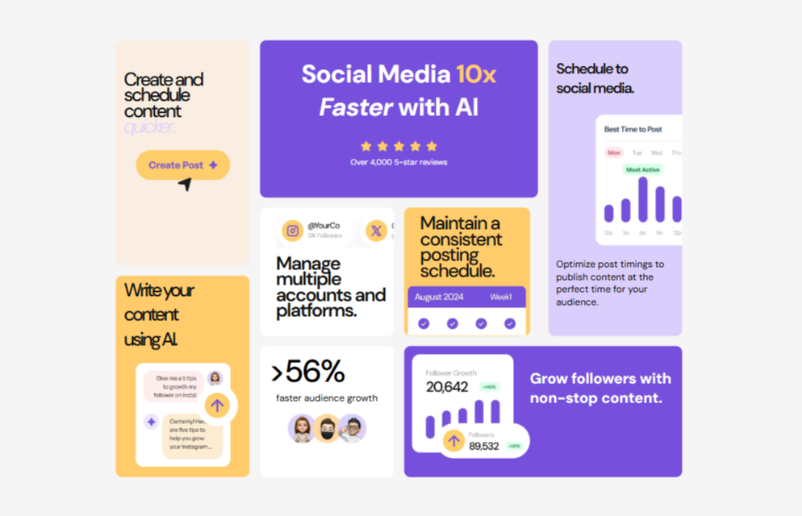

# Frontend Mentor - Bento Grid Solution

This is a solution to the [Bento grid challenge on Frontend Mentor](https://www.frontendmentor.io/challenges/bento-grid-RMydElrlOj). Frontend Mentor challenges help you improve your coding skills by building realistic projects.

## Table of Contents

- [Overview](#overview)
  - [The Challenge](#the-challenge)
  - [Screenshot](#screenshot)
  - [Links](#links)
- [My Process](#my-process)
  - [Built With](#built-with)
  - [What I Learned](#what-i-learned)
  - [Continued Development](#continued-development)
  - [Useful Resources](#useful-resources)
- [Author](#author)

## Overview

### The Challenge

Users should be able to:
- View an optimal layout of the Bento grid interface based on their device's screen size
- See a responsive design that adapts between mobile and desktop views
- Experience smooth transitions between different viewport sizes

### Screenshot




### Links

- Solution URL: [Add your solution URL here]
- Live Site URL: [Add your live site URL here]

## My Process

### Built With

- Semantic HTML5 markup
- CSS Grid and Flexbox
- Mobile-first workflow using media queries
- CSS Custom Properties for consistent theming
- CSS nesting for better organization
- Google Fonts (DM Sans)
- Responsive design principles

### What I Learned

- Advanced CSS Grid implementation with both mobile and desktop layouts
- CSS Grid template areas and responsive grid adjustments
- Media query breakpoints for different device sizes
- CSS nesting for better style organization
- Complex color scheme management using HSL values
- Responsive image handling
- Mobile-first design principles

Here are some key code snippets:

```css
/* Desktop Grid Layout */
.grid-container {     
    display: grid;  
    grid-template-columns: repeat(4, 1fr);
    grid-template-rows: repeat(12,1fr);
    gap: 13px;
    width: 50%;
    max-width: 1500px;
    margin: auto;
    height: 500px;
}

/* Responsive Design */
@media screen and (max-width: 767px) {   
    .grid-container {     
        display: none;   
    }      
    .grid-container2 {     
        display: block;  
    } 
}
```

### Continued Development

Areas I want to focus on in future projects:
- Further optimization of responsive breakpoints
- Implementation of animations and transitions
- Improvement of accessibility features
- Enhancement of mobile user experience
- Better organization of CSS using modern methodologies

### Useful Resources

- [CSS Grid Guide](https://css-tricks.com/snippets/css/complete-guide-grid/) - Comprehensive guide for CSS Grid
- [CSS Nesting Module](https://www.w3.org/TR/css-nesting-1/) - Understanding CSS nesting
- [Media Queries](https://developer.mozilla.org/en-US/docs/Web/CSS/Media_Queries) - For responsive design
- [HSL Color Values](https://developer.mozilla.org/en-US/docs/Web/CSS/color_value/hsl) - Understanding HSL color implementation

## Author

- Frontend Mentor - [@she-is-sarah](https://www.frontendmentor.io/profile/yourusername)
- LinkedIn - [Ebiesuwa Sarah] 